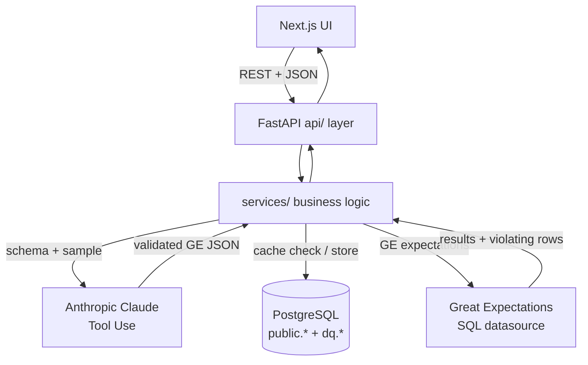
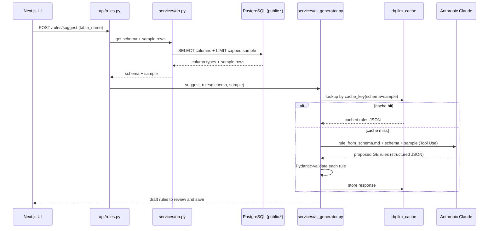
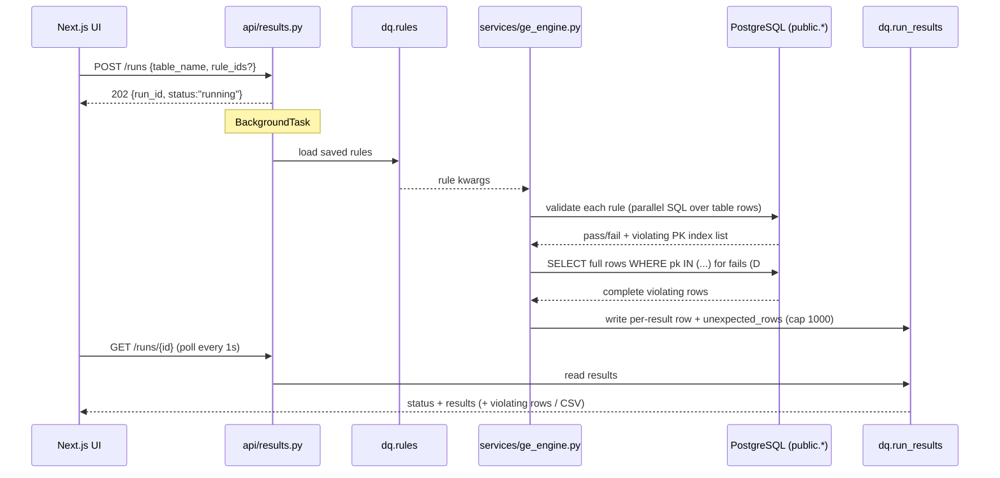

# Architecture — AI-Powered Data Quality Assistant

This document describes how the system is built and how a request flows through it.
For *why* each decision was made, see the Decision Logs in
[`day1-plan.md`](./day1-plan.md), [`day2-plan.md`](./day2-plan.md), and
[`day3-plan.md`](./day3-plan.md) (decisions are referenced below as `D#n`).

## 1. What it is

A 3-day MVP that lets a **non-technical domain expert** define and run data
quality rules against a PostgreSQL (Supabase) database through a chat-style web
UI — without knowing the Great Expectations (GE) framework. The LLM (Anthropic
Claude) turns table schemas and plain-English requests into structured GE
expectations; GE runs them; the UI shows pass/fail/error results with the actual
violating rows and an on-demand plain-English explanation of each failure.

## 2. Topology

A monorepo with two independently runnable services plus a managed database:

```
frontend/   Next.js (TypeScript)  — port 3000 — Table Explorer, Rule Manager, Results Dashboard
backend/    FastAPI (Python)      — port 8000 — AI generation, GE execution, REST API
            PostgreSQL (Supabase) — application data + the dq.* system schema
```

- **LLM**: Anthropic Claude `claude-sonnet-4-6`, called via Tool Use (structured output). No OpenAI dependency.
- **DB access**: SQLAlchemy + psycopg3 over the Supabase Session Pooler.
- **Config**: every env var flows through `app/config.py` (Pydantic Settings); nothing reads `os.environ` directly.

## 3. Request flow

### 3.1 Control flow (components)



1. The frontend calls a backend REST endpoint.
2. The `api/` layer (thin controllers) validates the request and delegates to `services/`.
3. For AI paths, the service builds a prompt from a template in `app/prompts/`, checks the LLM cache, and (on miss) calls Claude with a Tool Use schema that forces structured JSON.
4. LLM output is validated against a Pydantic model before it is persisted or returned.
5. For runs, GE executes the rules against the table and the service stores per-expectation results (plus full violating rows) in `dq.*`.
6. The frontend renders schema, rules, and results; long-running runs are polled until complete.

### 3.2 Data flow

The two paths below trace where the *actual data* moves — the part that matters
most is that real table rows are pulled out of Postgres and fed to the LLM as
context. Data never leaves the database except as the bounded sample the AI
needs to reason about it.

**AI rule suggestion** — `public.*` rows become LLM context:



The same pattern drives `POST /rules/from-nl`: the table's schema/sample plus
the user's chat history are the data fed to the LLM, and the response is cached
the same way.

**Run execution** — table rows flow through GE, and violating rows flow back into `dq.*`:



## 4. Three-layer backend

The backend is deliberately layered so HTTP concerns, business logic, and
persistence stay separate.

### API layer — `app/api/` (thin controllers)

| File | Responsibility |
|------|----------------|
| `tables.py` | List tables, table detail, sample rows |
| `rules.py` | Suggest / NL-translate / CRUD on rules |
| `results.py` | Trigger runs (async), fetch runs, explain failures, stream violating-rows CSV |
| `errors.py` | `raise_error(code)` + the single `CODE_MAP` of error codes (D#31) |

### Service layer — `app/services/` (business logic)

| File | Responsibility |
|------|----------------|
| `db.py` | SQLAlchemy engine/session, schema + sample inspection |
| `ai_generator.py` | Anthropic client, prompt loading, Tool Use calls, Pydantic validation, cache integration; prompt-version constants |
| `ge_engine.py` | Map rule JSON → GE expectations; parallel validation (`ThreadPoolExecutor`, D#29); fetch full violating rows (D#36) |
| `pk_inspector.py` | Resolve a table's primary key (single/composite/none) from `pg_index`/`pg_attribute` (D#36) |
| `llm_cache.py` | sha256 cache key, get/set/expire against `dq.llm_cache` (D#24) |
| `rules_store.py` | CRUD for `dq.rules` (supports `rule_ids` filtering) |
| `runs_store.py` | Create runs (`status='running'`), atomic `finalize_run`, write per-result rows + violating rows |

### Store / data layer — the `dq` schema

Application tables live in `public.*` (`policyholders`, `policies`, `claims`);
all DQ system state lives in a dedicated `dq` schema so rules and results are
queryable in one place (rather than in GE's file/cloud store).

| Table | Purpose | Introduced by |
|-------|---------|---------------|
| `dq.rules` | Saved GE rules (`expectation_type`, `kwargs` JSONB, `description`, `source`) | `001_dq_schema.sql` |
| `dq.runs` | One row per run: `status` (`running`/`success`/`failed`), timestamps, `error_message` | `001` + `running` state (D#23) |
| `dq.run_results` | Per-expectation result: `status` (`pass`/`fail`/`error`), `unexpected_count`, `unexpected_sample`, `unexpected_rows` (JSONB, capped 1000) + `truncated` | `001` → `002` (status) → `004` (rows) |
| `dq.llm_cache` | Cached LLM responses keyed by `cache_key`, with `expires_at` + `hit_count` | `003_llm_cache.sql` |

Migrations are plain SQL applied in order in the Supabase SQL Editor:
`schema.sql` → `seed.sql` → `001` → `002` → `003` → `004` → `005_dirty_data.sql`
(the last is a demo fixture of intentionally dirty rows).

## 5. Frontend structure

Next.js App Router; three views, switched by a `tab` query param per table.

- **Table Explorer** — `TableSidebar`, `SchemaView` (columns + 50-row sample).
- **Rule Management** — `RulesView` orchestrates `RuleCard` (with `RuleEditModal` + `DiffLines` for edit/diff, D#26) and `NlRuleInput` → `NlChatThread` (multi-turn chat, D#25).
- **Results Dashboard** — `ResultsView` (async polling + `RuleFilter`), `ResultRow` → `ViolatingRowsTable` (full rows, highlighted column, CSV, D#33–D#38) and `ResultExplainPanel` (LLM explanation, D#30).

Shared `lib/`: `api.ts` (fetch + `ApiError` envelope), `queries.ts` / `mutations.ts`
(TanStack Query; `useRunDetail` polls every 1 s while `status==='running'`),
`errorMessages.ts` (code → user-facing message map mirroring the backend `CODE_MAP`).

## 6. API endpoints

| Method | Path | Description |
|--------|------|-------------|
| GET | `/health` | Health check + active LLM model |
| GET | `/tables` | List tables + metadata |
| GET | `/tables/{name}` | Table detail (schema, row count) |
| GET | `/tables/{name}/sample` | Sample rows for AI context |
| POST | `/rules/suggest` | AI-suggest rules from schema + sample |
| POST | `/rules/from-nl` | Multi-turn NL → GE rule (or clarification) |
| GET / POST | `/rules` | List / create rules |
| PUT / DELETE | `/rules/{id}` | Update / delete rule |
| POST | `/runs` | Trigger run **async** → `202` + `status='running'` (D#23); optional `rule_ids` (D#28) |
| GET | `/runs` , `/runs/{id}` | List / fetch run (results stream in as rules complete) |
| POST | `/results/{id}/explain` | LLM explanation of a failed result (D#30) |
| GET | `/results/{id}/violations.csv` | Stream all violating rows as CSV (D#37) |

## 7. AI integration (overview)

- **Structured output**: all LLM calls use Anthropic Tool Use so responses are JSON matching a tool schema, then validated against Pydantic before use (D#7).
- **Prompt templates**: Markdown in `app/prompts/` with `{{variable}}` substitution — `rule_from_schema.md` (returns an array), `rule_from_nl.md` (single rule or `needs_clarification`), `explain_failure.md`.
- **Caching**: every LLM path checks `dq.llm_cache` first; the key includes a hard-coded `PROMPT_VERSION_*` per prompt, so bumping that constant is the invalidation mechanism whenever a prompt or model changes (the "prompt change SOP", D#24).
- **Multi-turn**: the NL endpoint is stateless — the full `ChatMessage[]` history is sent each turn and rebuilt into Anthropic block format server-side; conversation state lives only in the browser (D#25).
- **Explain failure**: on demand, the LLM is given the rule + violating sample and returns `{explanation, possible_causes[], suggested_action}` (D#30), cached like other paths.

## 8. Performance and resilience

- **Async runs** (D#23): `POST /runs` returns immediately; a FastAPI `BackgroundTask` executes GE and flips `dq.runs.status` via an atomic `UPDATE ... WHERE status='running'` guard. The UI polls `GET /runs/{id}`.
- **Parallel execution** (D#29): rules run on a `ThreadPoolExecutor(max_workers=4)`; IO-bound SQL releases the GIL, and `max_workers` is bounded by the SQLAlchemy pool size. A one-time retry absorbs Supabase Session Pooler connection recycling.
- **Three-state results** (D#18): `pass` / `fail` / `error` map to green / red / yellow — `error` means *fix the rule*, `fail` means *fix the data*.
- **Error envelope** (D#10/D#31): every error returns `{code, user_message, technical_detail}`; the frontend maps `code` to a title + possible-causes list. No raw stack traces reach the user.

## 9. Future Enhancements

Deliberately out of MVP scope. Each item describes what the system does today,
why that is a limitation, and what a production fix would involve. Items are
grouped by the engineering quality they most improve.

### 9.1 Product Thinking & UX

**Writing data from the UI (read-only MVP)** (per D#2)
- *Today*: the app is **read-only** by design — users can explore tables, get AI-suggested rules, and run checks, but cannot insert or edit the underlying `public.*` data through the UI. To demo a failing rule you have to manually run `005_dirty_data.sql` (or an `INSERT`) in the Supabase SQL Editor.
- *Limitation*: the "see a violation → fix the data → re-run" loop can't be completed in-app; it requires dropping out to raw SQL, which a non-technical user can't do.
- *Future*: in-UI data actions — e.g. inserting test rows to exercise rules, or editing/deleting the specific violating rows surfaced in a failed result — so the whole inspect-and-fix workflow stays inside the product. This would also subsume the manual dirty-data step in the demo.

**Draft persistence** (per D#19)
- *Today*: "Suggest rules" returns drafts that live only in frontend React state until you click Save; a page refresh discards any unsaved drafts.
- *Limitation*: unsaved suggestions are lost on refresh, which can feel like data loss.
- *Future*: persist drafts to `sessionStorage`/`localStorage` or a backend scratch table. It's intentionally deferred — D#19 keeps drafts non-persistent on purpose ("AI is a collaborator, not an overwriter," and drafts may contain PII), so adding persistence must also handle expiry and PII concerns.

**Smart-focus violating-row table** (per D#38)
- *Today*: expanding a failed result shows the **entire row** with every column, the violating column highlighted in red, and horizontal scroll for wide tables.
- *Limitation*: on a table with many columns, the user has to scroll sideways to find the one column the rule actually flagged.
- *Future*: a "show only the violating column / show all columns" toggle. It was deferred because hiding columns by default conflicts with D#33's promise to show the full row's context, so the MVP shows the whole row.

**Mobile layout** (descoped D#27)
- *Today*: the UI is built and tested for desktop widths (≥1024px).
- *Limitation*: on a phone the two-column layout and wide result tables don't reflow well.
- *Future*: a responsive layout with a collapsible drawer for the table sidebar. This was explicitly descoped before Day 3 implementation began.

### 9.2 Scalability & Performance

**Distributed runs** (per D#23)
- *Today*: `POST /runs` is asynchronous, but the background work uses FastAPI's built-in `BackgroundTasks`, which runs **inside the same backend process**.
- *Limitation*: if the process restarts mid-run, that in-flight run is lost and stays stuck at `status='running'`; and because all runs share one process, adding machines doesn't share the load.
- *Future*: move execution to Celery / RQ + a broker (e.g. Redis) so runs are queued, survive restarts (re-runnable), and scale across independent workers. The service layer is already decoupled, so this mainly changes *how a run is dispatched*, not the business logic.

**Cache backing store + GC** (per D#24/D#37)
- *Today*: the LLM cache is just a **Postgres table** (`dq.llm_cache`) — the MVP uses the database itself as the cache store (chosen in D#24 to avoid adding infrastructure). Every run's violating rows are likewise frozen into `dq.run_results.unexpected_rows`. Nothing is ever deleted.
- *Limitation*: these tables grow forever. At demo scale that's invisible, but a production database running many rules over large tables would accumulate stale rows and expired cache entries indefinitely. Using the primary database as a cache also means cache reads/writes compete with real query load.
- *Future*: two moves. (1) Move the LLM cache out of Postgres into **Redis** — a purpose-built cache with native TTL expiry (so entries self-evict and there's no GC to run), faster lookups, and no load on the primary DB. (2) For run history / violating rows that must stay in Postgres, add a scheduled cron job (or a documented manual cleanup SOP) to purge old runs and stale violating rows.

**Representative data sampling** (per D#6)
- *Today*: the schema/sample endpoint returns the **first 50 rows** (`LIMIT 50`, no randomisation), and those same rows are the data the LLM reasons about when suggesting rules.
- *Limitation*: "first 50" isn't "representative 50" — tables usually have an implicit ordering (autoincrement PK, `created_at`), so the LLM only sees the oldest data. If a column's value distribution changed over time (e.g. a `product_type` category added later), the LLM never sees it and may propose a rule that flags all the newer rows as violations. The bias worsens as the table grows.
- *Future*: a more representative sample that stays cache-friendly — a deterministic shuffle with a fixed seed (`ORDER BY md5(id || seed)` or `TABLESAMPLE ... REPEATABLE(seed)`) so the same underlying data always yields the same sample (cache still hits) while breaking the ordering bias; optionally stratified sampling over key categorical columns. Plain `ORDER BY random()` is avoided precisely because its non-determinism would change the sample every call and defeat the D#24 cache.

**Longer / cross-device NL chat** (per D#25)
- *Today*: the natural-language rule chat is capped at **5 user turns (10 messages)** and the conversation lives only in browser React state — it's stateless on the backend, so a refresh clears it and it can't be resumed on another device.
- *Limitation*: a user can't carry a refinement conversation across a refresh or between their phone and laptop, and a genuinely long back-and-forth hits the turn cap and must be reset.
- *Future*: persist conversations server-side (a `dq.chat_sessions` table or similar) so they survive refreshes and can be resumed cross-device, and raise/remove the turn cap with proper token-budget management. This was deliberately deferred in D#25 — keeping the conversation client-only is also a privacy feature, since NL prompts may contain PII, so server-side persistence must be paired with the PII-masking work below.

**No-primary-key tables** (per D#36)
- *Today*: to show a full violating row, GE returns the **primary-key index** of each violating row and the backend reverse-looks it up with `SELECT * WHERE pk IN (...)`. This depends on the table having a primary key.
- *Limitation*: a table with no PK has nothing to reverse-look-up by, so `pk_inspector` returns `None`, `unexpected_rows` is empty, and the UI shows a "This table has no primary key — row data unavailable" fallback. (The three demo tables all have a single-column `id` PK, so they're unaffected.)
- *Future*: an alternate row-identity mechanism for PK-less tables — PostgreSQL's built-in `ctid` (physical row location) as a temporary identifier, or a synthetic row identity.

**Cross-rule expectations** (per D#29)
- *Today*: rules are executed in parallel on a thread pool, which assumes each rule is independent of the others.
- *Limitation*: an expectation that depends on another rule's outcome (e.g. "only check B if A passed") would break under parallel execution.
- *Future*: a dependency model that runs interdependent rules in the correct order while still parallelising the independent ones.

### 9.3 Maintainability & Developer Experience

**Schema migration tooling** (per D#13)
- *Today*: schema changes are individual `.sql` files (`001`–`005`) applied by hand, in order, in the Supabase SQL Editor. The database keeps no record of which files have run, and some aren't safe to re-run (`005` errors on duplicate data; `001`'s `CREATE TABLE` has no `IF NOT EXISTS`).
- *Limitation*: there's no way to know which migrations a given database has applied, no enforced ordering, and no rollback — correctness depends entirely on a human running the right files once, in the right order. A new machine or teammate has to guess the current state.
- *Future*: adopt Alembic (an `alembic_version` table tracks the current revision; `upgrade`/`downgrade` apply or revert migrations in order with rollback), or at minimum a `dq.schema_migrations(version, applied_at)` table so applied state is queryable.

**Frontend/backend contract parity** (per D#9/D#31)
- *Today*: the API contract is hand-written on both sides — frontend `types/api.ts` mirrors the backend Pydantic models, and `lib/errorMessages.ts` mirrors the backend `CODE_MAP`. Nothing enforces that the two copies stay in sync.
- *Limitation*: a backend change (a renamed field, a new error code) still compiles on the frontend because its copy is an independent declaration, so the mismatch only surfaces at runtime — an `undefined` value, or an error that falls through to the generic fallback card instead of showing its possible-causes list.
- *Future*: generate `types/api.ts` from FastAPI's OpenAPI schema (e.g. `openapi-typescript`) so types track the backend automatically, and add a contract test asserting the frontend error-code map matches the backend `CODE_MAP` (or expose the codes via an endpoint the frontend consumes).

**Unique constraint on rules** (per D#22)
- *Today*: nothing at the database level prevents two identical rules (same `expectation_type` + `kwargs`) from being saved for the same table; duplicate suggestions are instead surfaced transparently with an "Already saved" badge.
- *Limitation*: a determined user can still create exact-duplicate rules, which would run twice and clutter results.
- *Future*: a DB-level `UNIQUE` constraint on `(table_name, expectation_type, kwargs)` to dedup at the source.

### 9.4 Security & Privacy

**PII masking** (per D#30/D#33/D#37)
- *Today*: violating rows (stored in `dq.run_results.unexpected_rows`) and the sample rows sent to the LLM are stored and transmitted as-is — including fields like `national_id`, `email`, and `phone`.
- *Limitation*: real personal data would be persisted in the DB and sent to a third-party LLM. It's acceptable now only because the demo uses entirely fake data.
- *Future*: mask sensitive fields at two points — before writing to the DB and before sending to the LLM (e.g. `A123456789` → `A12****789`). This touches the explain-failure (D#30), full-row display (D#33), and persisted-violations (D#37) paths, which is why they're grouped here.

**Multi-user auth**
- *Today*: the app is single-tenant with no login — anyone who can reach it sees and edits the same rules and runs.
- *Limitation*: no authentication, no per-user isolation, no audit of who created or ran what.
- *Future*: authentication plus per-user (or per-team) ownership of rules and runs.
